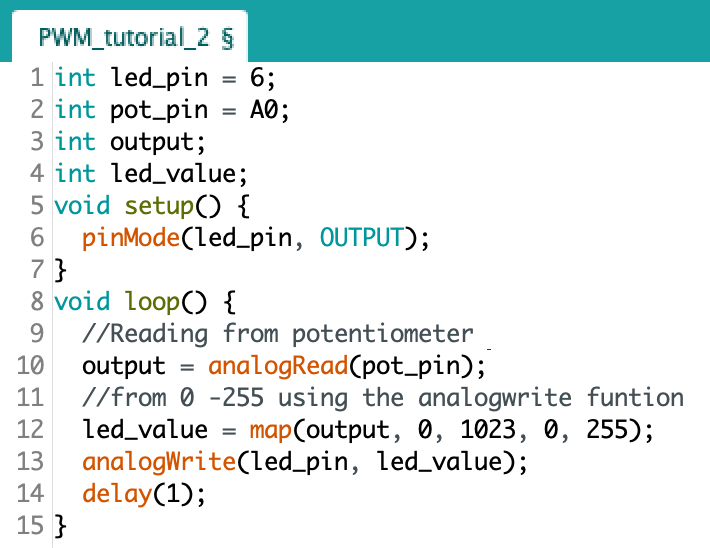
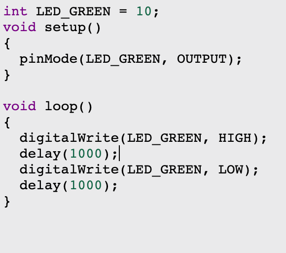

# Y11 IT Robotics Blog 

## 4/9/22

Bit math

Using shift registries to read and compare 8 digit binary numbers, then show visually using LED's

lacking shift register hardware

## 29/8/22

Exams

no work do

## 22/8/22

Exam week prep

no time for blog

sorry

## 15/8/22

This week of IT was mainly focused on game dev work and was therefore devoid of any substantial robotics

## 8/8/22

Finished Arduino Components document

Array Blinking Led

Uses an array to reference which led to turn on in a line

## 1/8/22 

Worked on Arduino Components document

Completed Switch cases task

This circuit uses a switch case to turn the many possible potentiometer values into a few cases to change the brightness of a led

This code uses functions to calculate the hypotenuse of a triangle given opposite and adjacent sides

## 25/7/22 Begining of Term 3 Blog

Worked trough the PWM Document and created the circuits

The images for the phisical build are being difficult so if they are not there it means that i couldnt fix it

-

-

-

-

-

-

##

## 2/5/22 Begining of Term 2 Blog

Simulated arduino circuitboard in tinkercad

## 7/4/22 Turns out the Assignment was due

Turned in assignment 

Bionic ears can do stuff

Overveiw: Not great

## 28/3/22 Simple Arduino hardware Intro

Research Task issued

Requires to do research on a topic of robotics and mechatronics
-begun research on UNSW Bionic eye

Overveiw: not much happened

## 21/3/22 Simple Arduino hardware Intro

Missed Lesson on Monday Due to Public Holiday

Cyber Live

Begun cyber live course on grok

Screenshots

_____________________________________________

Arduino

Solved connection issue

Project 13

Fan Constantly spinning

Shouldn't do that

______________________________________________

Overview: Begun cyber live course work in class and therefore had less time to do Arduino work

## 15/3/22
Ardino project

Project 13

Encountered an error connecting the Controlling device to the arduino
Belived to be due to overdrawing power from device

______________

CyberSecurity preperation

CyberLive

Encrypting data in a file

Overveiw: Need to solve power problem for arduino and do GROK Cyber Course

## 7/3/22 Simple Arduino hardware Intro
Arduino projects 

**Projects from last week**

Project 3
Interactive Trafficlights

Arduino

Code
 

Project 4
Breathing LED

Arduino

Code
 

Project 5
Colour RGB LED

Arduino

Code
 

Project 6
Alarm

Arduino

Code
 

Project 7
Temperature Alarm

Arduino

Code
 

**Projects from this Week**

Project 8
Vibration Sensor

Arduino

Code
 

Project 9
Light sensitive LED

Arduino

Code
 

Project 10
How to Drive a Servo

Arduino

Code
 

Project 11
Controllable servo

Arduino

Code
 

Project 12
Interactive Adjustable RGB LED

Arduino

Code
 

Overveiw:

Continued use of new Arduino hardware, introducing pushbutton switchers, ambient light sensors, tilt switch sensors, busters, potentiometers and servos, and finding out how they interact with code

## 28/2/22 Robotics cont.

Arduino Projects

Project 3
Dynamic traffic lights

Code

ill do it next week
(technically not late)

## 21/2/22 Initial robotics

Micro:bits
Micropython

Show screenshots

Arduino projects 

Project 2
LED SOS Signal

Arduino

N/A

Code
 
 

Project 3
Dynamic traffic lights

Arduino

N/A

Code

N/A

Overveiw:

Beginning a new topic with basic breadboards and c++
